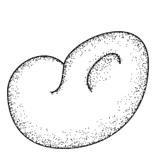

This page accompanies the paper [Caustic Skeleton and the Local Cosmic Web: the Coma Cluster node and the Pisces Perseus ridge (2026)](). We provide additional video material for Figures [4] and [8] referenced in the Section [4] of the text.

---

## Caustic skeleton of Coma Cluster and Stickman

**Description:** [This figure shows the caustic skeleton around the Coma Cluster in both Lagrangian space (top panels) and Eulerian space (bottom panels) in a $L = 100 $ Mpc box extracted from one example of a \texttt{Manticore-Local} Universe re-simulation (refer to as $M_1$). We use the smoothing scale of $\sigma =3$ Mpc. Left: $A_3$ walls with $A_4$ and $D_4$ filaments. Middle: Both $A_4$ and $D_4$ filaments. Right: $D_4$ filaments alone. The 3-dimensional first eigenvalue field of the deformation tensor is also included in the top Lagrangian-space panels, and the density field in the bottom Eulerian-space panels. The density is estimated with the Phase-Space Delaunay Tessellation Field Estimator (Feldbrugge 2024; Feldbrugge & Hertzsch 2025)]

**Referenced in:** Section [4.1] / Figure [4]

**Rotating:** [rotate_box_coma.mp4](figures/rotate_box_coma.mp4)

{width=100%}

**Zoom-in:** [zoom_in_coma.mp4](figures/zoom_in_coma.mp4)

{width=100%}
---

## Caustic skeleton of Pisces-Perseus Supercluster

**Description:** [This figure shows the caustic skeleton of the Pisces-Perseus Supercluster in a $60$ Mpc box for $M_1$ Local Universe re-simulation. Coordinates are rotated so that the positive $Z_R$-direction is roughly along the line of sight and RA and DEC correspond to positive $Y_R$ and negative $X_R$ directions. Left: $A_3$ walls with $A_4$ and $D_4$ filaments, Middle: $A_4$ and $D_4$ filaments, Right: Only $D_4$ filaments. We use the smoothing scale of $\sigma =3$ Mpc. The density is estimated with the Phase-Space Delaunay Tessellation Field Estimator (Feldbrugge 2024; Feldbrugge & Hertzsch 2025).]

**Referenced in:** Section [4.2] / Figure [8]

**Rotating:** [rotate_box_pp.mp4](figures/rotate_box_pp.mp4)

{width=100%}

**Zoom-in:** [zoom_in_pp.mp4](figures/zoom_in_pp.mp4)

{width=100%}

<!-- <figure>

 <figcaption> Fig. 1 - A compact two-dimensional manifold</figcaption>
</figure>
 -->
